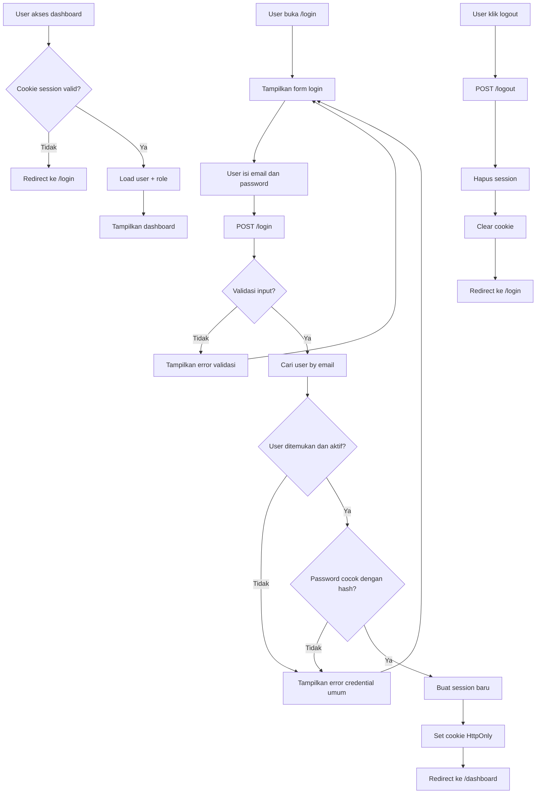

# Flowchart — Auth & Login Penulis

```mermaid
flowchart TD
    A[User buka /login] --> B[Tampilkan form login]
    B --> C[User isi email dan password]
    C --> D[POST /login]
    D --> E{Validasi input?}
    E -- Tidak --> F[Tampilkan error validasi]
    F --> B
    E -- Ya --> G[Cari user by email]
    G --> H{User ditemukan dan aktif?}
    H -- Tidak --> I[Tampilkan error credential umum]
    I --> B
    H -- Ya --> J{Password cocok dengan hash?}
    J -- Tidak --> I
    J -- Ya --> K[Buat session baru]
    K --> L[Set cookie HttpOnly]
    L --> M[Redirect ke /dashboard]

    N[User akses dashboard] --> O{Cookie session valid?}
    O -- Tidak --> P[Redirect ke /login]
    O -- Ya --> Q[Load user + role]
    Q --> R[Tampilkan dashboard]

    S[User klik logout] --> T[POST /logout]
    T --> U[Hapus session]
    U --> V[Clear cookie]
    V --> W[Redirect ke /login]
```
