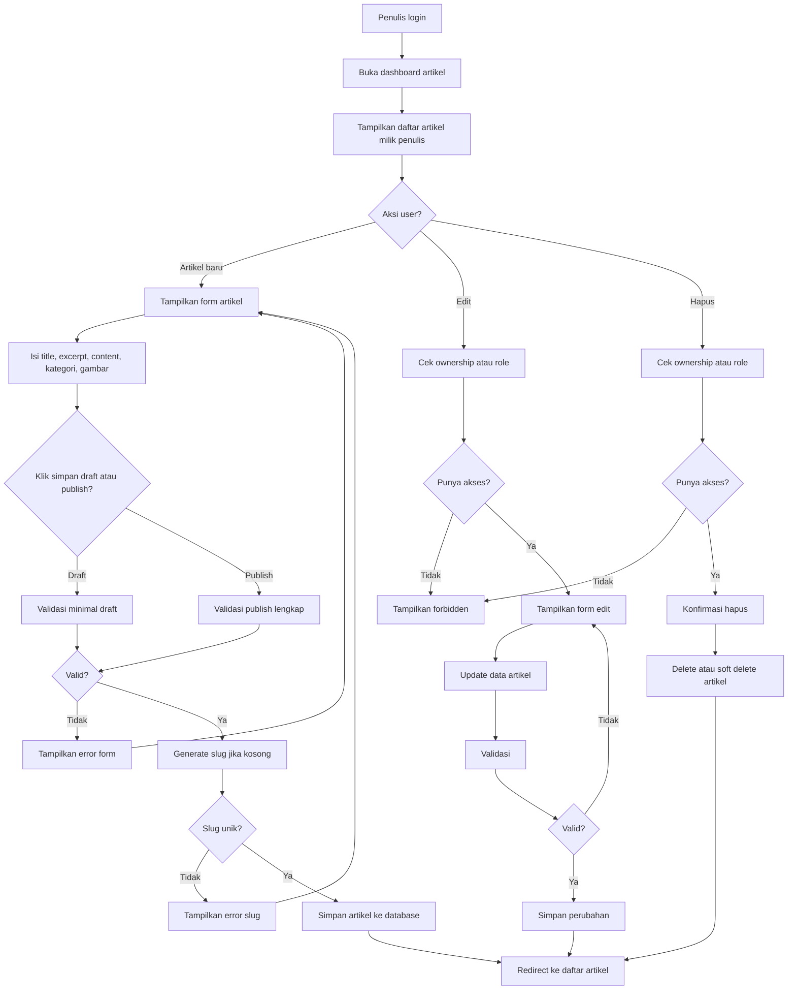

# Flowchart — Manajemen Artikel

```mermaid
flowchart TD
    A[Penulis login] --> B[Buka dashboard artikel]
    B --> C[Tampilkan daftar artikel milik penulis]
    C --> D{Aksi user?}

    D -- Artikel baru --> E[Tampilkan form artikel]
    E --> F[Isi title, excerpt, content, kategori, gambar]
    F --> G{Klik simpan draft atau publish?}
    G -- Draft --> H[Validasi minimal draft]
    G -- Publish --> I[Validasi publish lengkap]
    H --> J{Valid?}
    I --> J
    J -- Tidak --> K[Tampilkan error form]
    K --> E
    J -- Ya --> L[Generate slug jika kosong]
    L --> M{Slug unik?}
    M -- Tidak --> N[Tampilkan error slug]
    N --> E
    M -- Ya --> O[Simpan artikel ke database]
    O --> P[Redirect ke daftar artikel]

    D -- Edit --> Q[Cek ownership atau role]
    Q --> R{Punya akses?}
    R -- Tidak --> S[Tampilkan forbidden]
    R -- Ya --> T[Tampilkan form edit]
    T --> U[Update data artikel]
    U --> V[Validasi]
    V --> W{Valid?}
    W -- Tidak --> T
    W -- Ya --> X[Simpan perubahan]
    X --> P

    D -- Hapus --> Y[Cek ownership atau role]
    Y --> Z{Punya akses?}
    Z -- Tidak --> S
    Z -- Ya --> AA[Konfirmasi hapus]
    AA --> AB[Delete atau soft delete artikel]
    AB --> P
```
