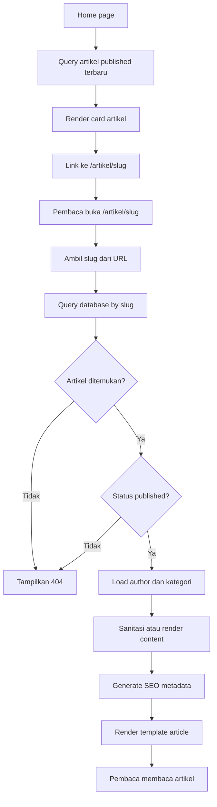

# Flowchart — Publikasi & Halaman Baca Artikel

```mermaid
flowchart TD
    A[Pembaca buka /artikel/slug] --> B[Ambil slug dari URL]
    B --> C[Query database by slug]
    C --> D{Artikel ditemukan?}
    D -- Tidak --> E[Tampilkan 404]
    D -- Ya --> F{Status published?}
    F -- Tidak --> E
    F -- Ya --> G[Load author dan kategori]
    G --> H[Sanitasi atau render content]
    H --> I[Generate SEO metadata]
    I --> J[Render template article]
    J --> K[Pembaca membaca artikel]

    L[Home page] --> M[Query artikel published terbaru]
    M --> N[Render card artikel]
    N --> O[Link ke /artikel/slug]
    O --> A
```
