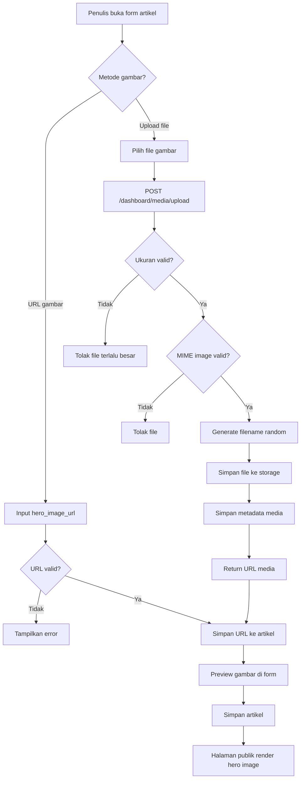

# Flowchart — Media & Gambar Artikel

```mermaid
flowchart TD
    A[Penulis buka form artikel] --> B{Metode gambar?}

    B -- URL gambar --> C[Input hero_image_url]
    C --> D{URL valid?}
    D -- Tidak --> E[Tampilkan error]
    D -- Ya --> F[Simpan URL ke artikel]

    B -- Upload file --> G[Pilih file gambar]
    G --> H[POST /dashboard/media/upload]
    H --> I{Ukuran valid?}
    I -- Tidak --> J[Tolak file terlalu besar]
    I -- Ya --> K{MIME image valid?}
    K -- Tidak --> L[Tolak file]
    K -- Ya --> M[Generate filename random]
    M --> N[Simpan file ke storage]
    N --> O[Simpan metadata media]
    O --> P[Return URL media]
    P --> F

    F --> Q[Preview gambar di form]
    Q --> R[Simpan artikel]
    R --> S[Halaman publik render hero image]
```
