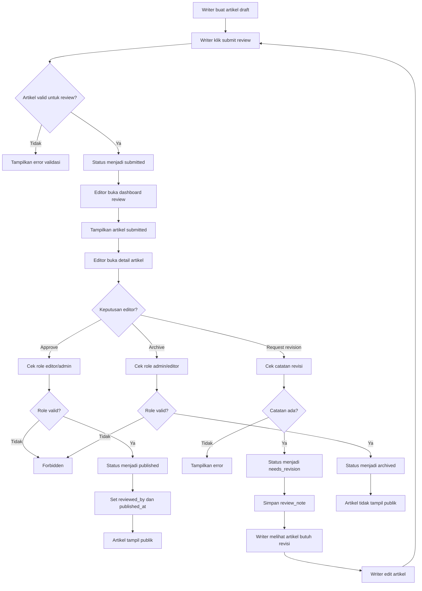

# Flowchart — Admin, Review, dan Role Artikel

```mermaid
flowchart TD
    A[Writer buat artikel draft] --> B[Writer klik submit review]
    B --> C{Artikel valid untuk review?}
    C -- Tidak --> D[Tampilkan error validasi]
    C -- Ya --> E[Status menjadi submitted]

    E --> F[Editor buka dashboard review]
    F --> G[Tampilkan artikel submitted]
    G --> H[Editor buka detail artikel]
    H --> I{Keputusan editor?}

    I -- Approve --> J[Cek role editor/admin]
    J --> K{Role valid?}
    K -- Tidak --> L[Forbidden]
    K -- Ya --> M[Status menjadi published]
    M --> N[Set reviewed_by dan published_at]
    N --> O[Artikel tampil publik]

    I -- Request revision --> P[Cek catatan revisi]
    P --> Q{Catatan ada?}
    Q -- Tidak --> R[Tampilkan error]
    Q -- Ya --> S[Status menjadi needs_revision]
    S --> T[Simpan review_note]
    T --> U[Writer melihat artikel butuh revisi]
    U --> V[Writer edit artikel]
    V --> B

    I -- Archive --> W[Cek role admin/editor]
    W --> X{Role valid?}
    X -- Tidak --> L
    X -- Ya --> Y[Status menjadi archived]
    Y --> Z[Artikel tidak tampil publik]
```
