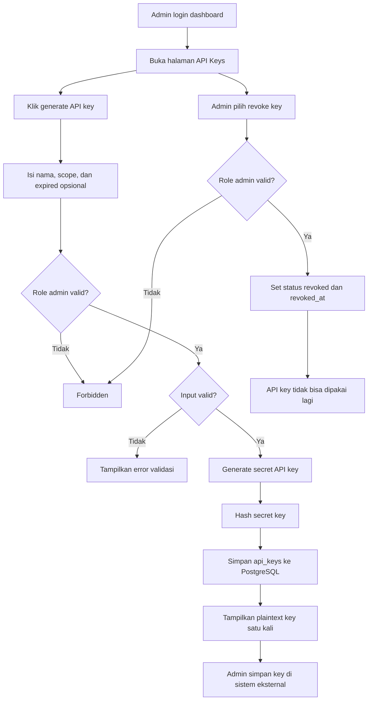
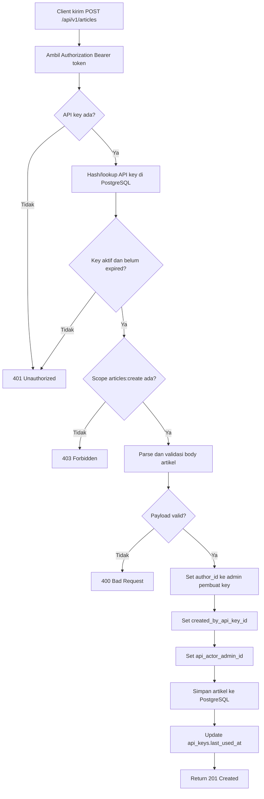
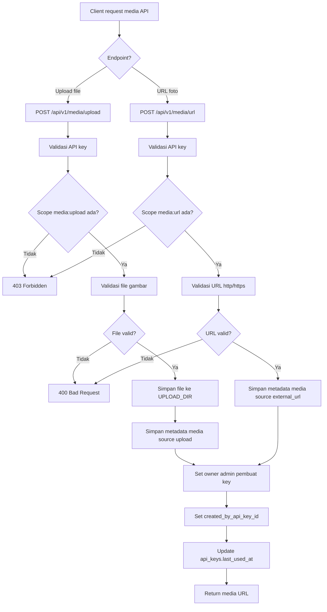
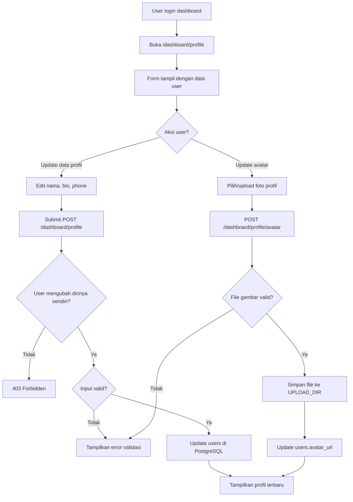
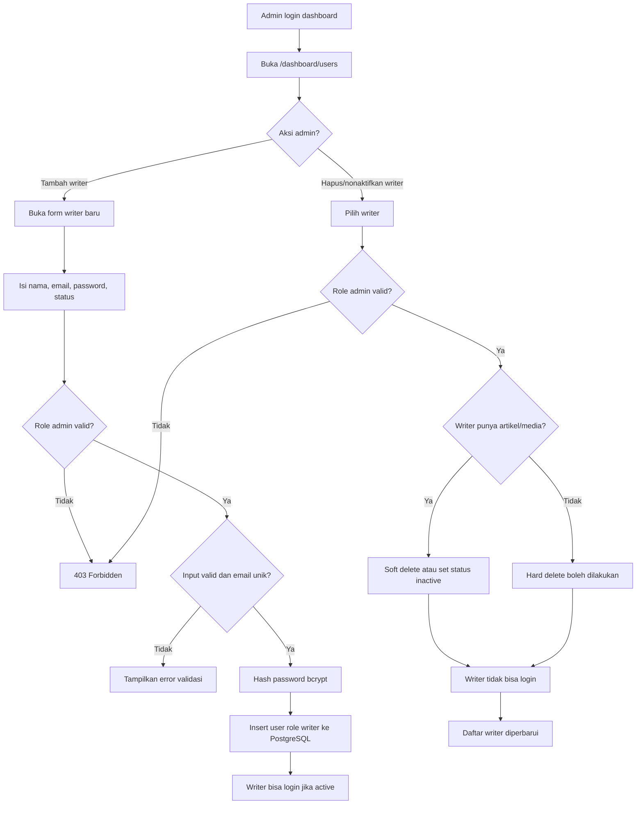
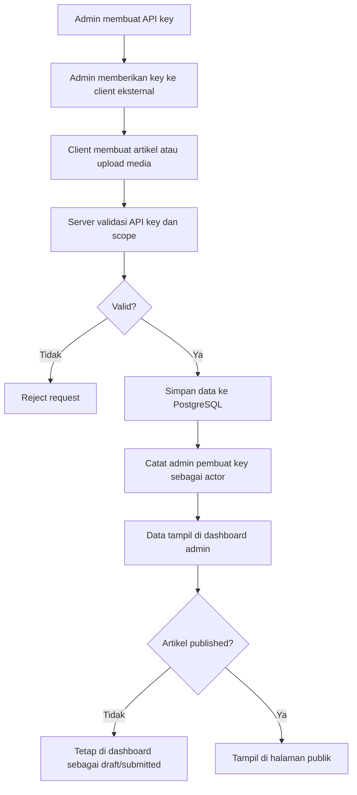

# Flowchart — API Key Admin, Profile User, dan Manajemen Writer

## 1. Generate dan Revoke API Key

## 2. API Key untuk Post Artikel

## 3. API Key untuk Upload Foto atau URL Foto

## 4. User Mengatur Profile dan Foto Profil

## 5. Admin Menambahkan dan Menghapus Writer

## Flow Utama Integrasi Eksternal

